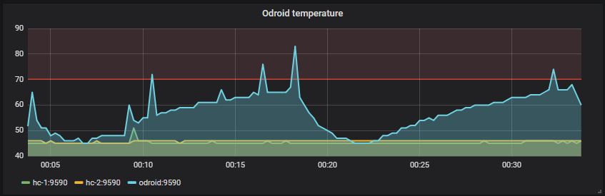

# odroid-helper
Odroid temperature prometheus exporter + CloudShell fan control



Installation
```
wget https://github.com/autowp/odroid-helper/releases/download/v1.0.0/odroid-helper-1.0.0.deb
dpkg -i odroid-helper-1.0.0.deb
```

Start/stop service
```
systemctl start odroid-helper
systemctl stop odroid-helper
```

Usage of /usr/bin/odroid-helper:
```
  -addr string
    	The address to listen on for HTTP requests. (default ":9590")
  -debug
    	Enable debug output.
  -fan-interval duration
    	The interval at which the fan is adjusted. (default 2s)
  -interval duration
    	The interval at which the temperature is checked. (default 10s)
  -start-fan-cmd string
    	Start fan cmd. (default "i2cset -y 1 0x60 0x05 0x00")
  -start-fan-threshold float
    	Start fan threshold (default 75)
  -stop-fan-cmd string
    	Stop fan cmd. (default "i2cset -y 1 0x60 0x05 0x05")
  -stop-fan-threshold float
    	Stop fan threshold (default 45)
```
  
Prometheus config example
```
  scrape_configs:
  - job_name: 'odroid'
    honor_labels: true
    target_groups:
      - targets: ['odroid:9590', 'hc-1:9590', 'hc-2:9590']
```

Grafana prometheus expr example (show only zone0): `odroid_temperature_celsius{job='odroid',zone='zone0'}`
